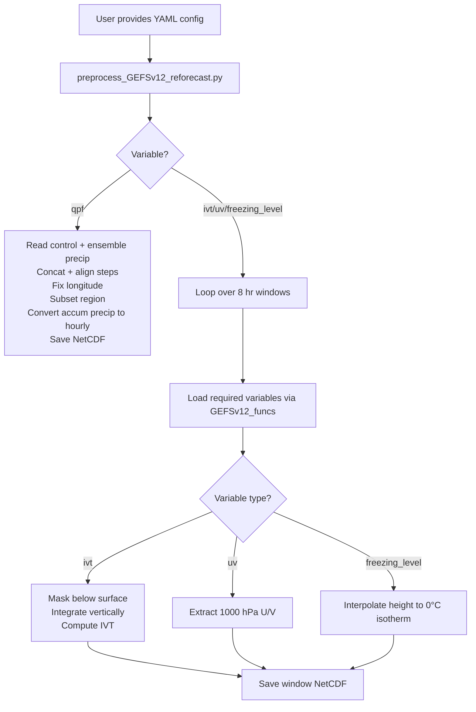

# Preprocess GEFSv12 Reforecast Data

This directory contains scripts to **preprocess GEFSv12 Reforecast data**. After downloading the raw data (see `../downloads/`), run these preprocessing scripts in the following order.

---

## Preprocessing Workflow

1. **Create configuration files**

   * Generates `.txt` and `.yaml` files for batching preprocessing with SLURM.

2. **Run preprocessing for GEFSv12 Reforecast (2000–2019)**

   * Processes raw GEFSv12 reforecast data and computes intermediate outputs:

     * Integrated Water Vapor Transport (**IVT**, kg m⁻¹ s⁻¹)
     * Height of the freezing level (**m**)
     * 1000 hPa U/V winds (**m s⁻¹**)
     * Quantitative Precipitation Forecast (**QPF**)
   * Submit jobs via SLURM:

   ```bash
   sbatch run_preprocess_GEFSv12_reforecast.slurm
   ```

   * Update the `calls_x.txt` file in the SLURM script to select which jobs to run.

---

## Workflow Diagram



---

## Notes

* Make sure your environment has all required dependencies installed (e.g., `xarray`, `cfgrib`, `wrf-python`).
* The preprocessing scripts rely on **GEFSv12_funcs.py** for reading, regridding, and calculating derived variables.
* Intermediate NetCDF files are saved per time window and variable. These files are later concatenated using scripts in `concat_gefsv12`.
* Ensure sufficient disk space for intermediate and final outputs.
